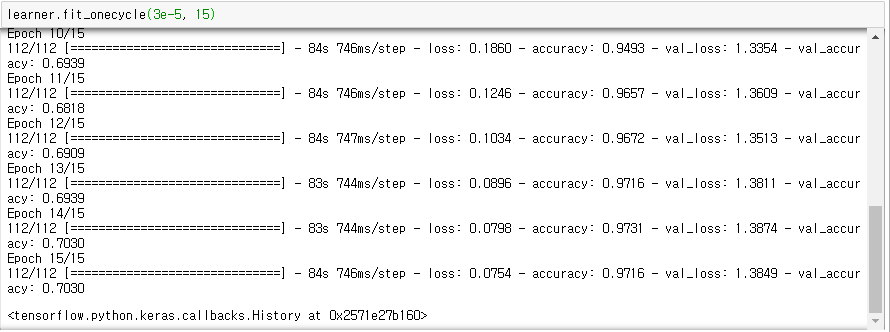

# ALBERT-Text-Classification
[🇰🇷 국민청원 카테고리 분류](ko.md)


Detailed descriptions can be found at [Blog](https://hipgyung.tistory.com/93)

## Install Package
``` python
pip install ktrain
```

## How to use
```
python main.py --csv data.csv --label Category --data Resume --epoch 5

python main.py --csv data.csv --label label_name --data data_name --epoch 5
```

## Available models
- BERT: bert-base-uncased, bert-large-uncased, bert-base-multilingual-uncased, and others.
- DistilBERT: distilbert-base-uncased, distilbert-base-multilingual-cased, distilbert-base-german-cased, and others
- ALBERT: albert-base-v2, albert-large-v2, and others
- RoBERTa: roberta-base, roberta-large, roberta-large-mnli
- XLM: xlm-mlm-xnli15–1024, xlm-mlm-100–1280, and others
- XLNet: xlnet-base-cased, xlnet-large-cased

## Outstanding performance
  
97%

## predictor
You can use the function below.
``` python
def predictor(learner, test):
	predictor = ktrain.get_predictor(learner.model, preproc=t)
	print(predictor.predict(test))

```

## tensorboard
```
pip install tensorboard==1.12.2

#tensorboard --logdir==training:your_log_dir --host=127.0.0.1
tensorboard --logdir==training:logs/ --host=127.0.0.1
```

## Library
> https://github.com/amaiya/ktrain